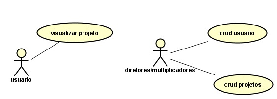
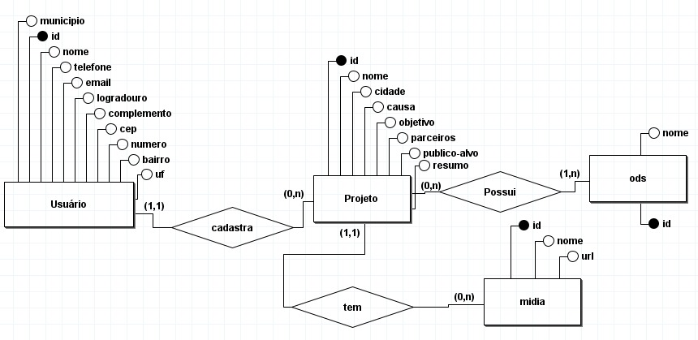
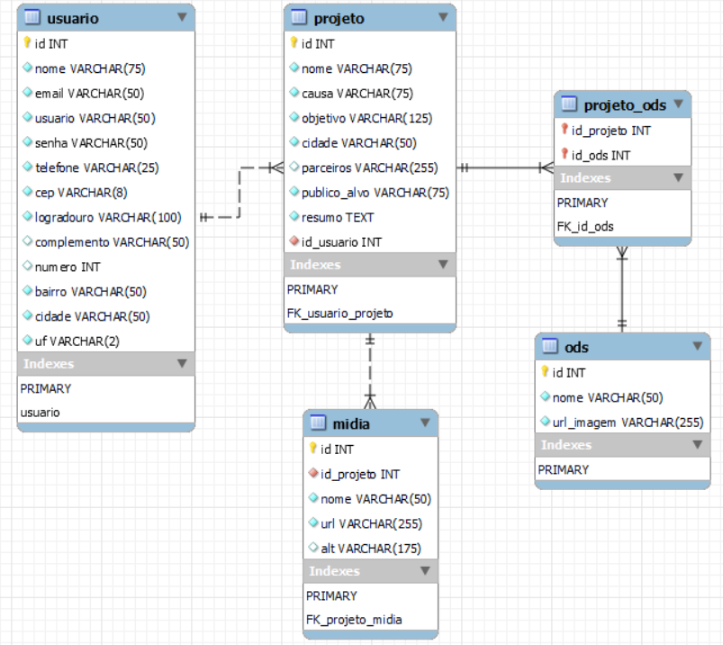
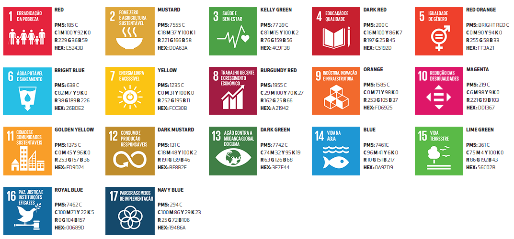
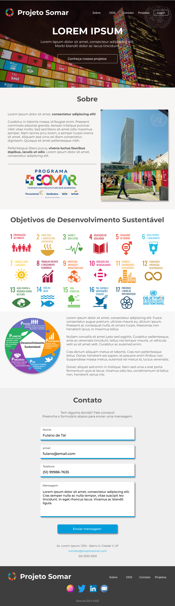
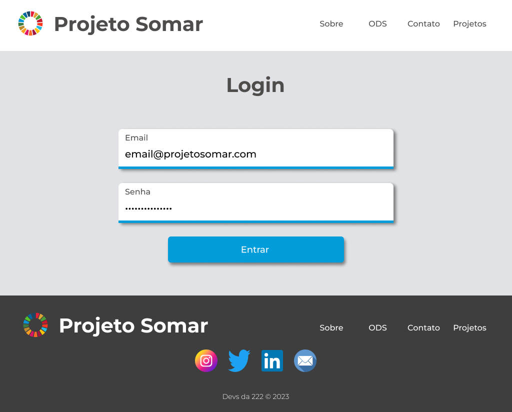
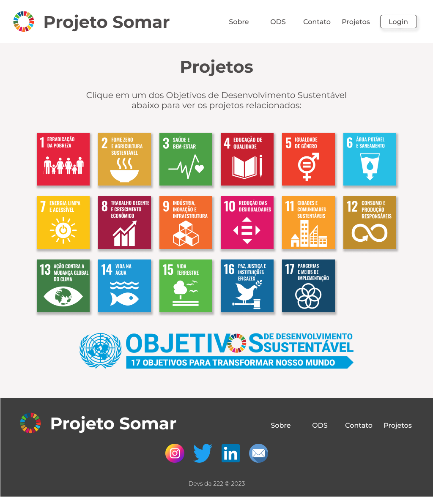
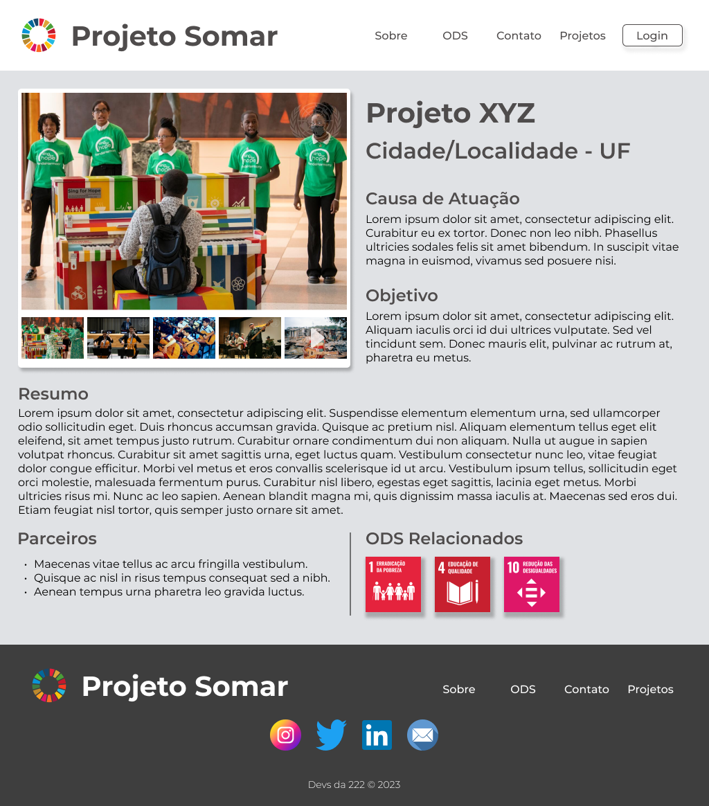

# Plataforma Programa Somar

## Time

**Nome**: Devs da 222

**Integrantes**: Enzo Andrade, Felipe Verdade, Glauber Martini, Gustavo Kruger, Lucas da Paz

**Turma**: DEV1N222

## Índice

- [Produto](#produto)
- [Objetivo (meta)](#objetivo-meta)
- [Requisitos](#requisitos)
- [Tarefas](#o-que-é-preciso-fazer)
- [Diagramas](#diagramas)
- [Cronograma](#cronograma)
- [Linguagens, frameworks e ferramentas](#linguagens-frameworks-e-ferramentas)
- [Questões](#questões)
- [Design e layouts](#design-e-layouts)

## Produto

Website para registro e mapeamento dos projetos realizados dentro do programa Somar.

## Objetivo (meta)

Desenvolver, em quatro meses, um site que visa a comunicação com a sociedade via exposição dos projetos e divulgação dos Objetivos de Desenvolvimento Sustentável (ODS).

## Requisitos

### Funcionais

- [ ] CRUD projetos;
- [ ] CRUD usuários;
- [ ] Deve ser possível realizar a filtragem de projetos:
  - [ ] por ODS;
  - [ ] por cidade;
  - [ ] por causa de atuação;
  - [ ] por público-alvo.
- [ ] Deve ser possível adicionar até 5 imagens por projeto;
- [ ] Deve ser possível adicionar um vídeo de até 2min de duração por projeto;
- [ ] Deve ser possível visualizar a quantidade total de projetos;
- [ ] Deve ser possível visualizar a quantidade de projetos por ODS.

### Não funcionais

- [ ] O site deve ser acessível a todos os tipos de usuários (acessibilidade);
- [ ] O site deve ser responsivo e funcionar em desktop e dispositivos móveis.

## O que é preciso fazer?

- [x] Elaborar documentação técnica;
- [x] Decidir linguagens, frameworks e ferramentas que serão utilizados;
- [x] Elaboração de protótipo do site;
- [x] Criação do banco de dados;
- [ ] Desenvolver página inicial;
- [ ] Desenvolver página de login;
- [ ] Desenvolver página de cadastro de projeto;
- [ ] Desenvolver página “Conheça nossos projetos”;
- [ ] Desenvolver página de projeto;
- [ ] Desenvolver funcionalidades.

## Diagramas

### Casos de uso

### ER (Entidade-Relacionamento)

### Relacional

## Cronograma

- [x] 17/03 - Início do projeto;
- [x] 24/03 - Início da documentação técnica e primeiro esboço do projeto;
- [x] 31/03 - Diagramação e escolha das linguagens e _frameworks_ que serão utilizados;
- [ ] 07/04 - Avaliação das entregas pela banca avaliadora.

### Fase 1 - Projeto Base (_MVP_)

- [ ] 14/04 - Página inicial e página de login;
- [ ] 21/04 - Página “conheça nossos projetos”;
- [ ] 28/04 - Página de projeto;
- [ ] 05/05 - Apresentação da **Fase 1** para a equipe do comitê de sustentabilidade.

### Fase 2 - Funcionalidades Recomendáveis

- [ ] 12/05 a 09/06 - Visualização de contabilização de quantos projetos ao total, quantos para cada ODS e possibilidade de _upload_ de até 5 fotos por projeto;
- [ ] 16/06 - Apresentação das **Fases 1 e 2** para a equipe do comitê de sustentabilidade.

### Fase 3 - Funcionalidades Diferenciadas

- [ ] 23/06 a 14/07 - Possibilidade de _upload_ de um vídeo de até dois minutos por projeto e filtros para visualização de projetos por cidade, ODS, causa de atuação e público-alvo;
- [ ] 21/07 - Banca avaliadora irá avaliar o desenvolvimento do projeto como um todo;
- [ ] 27/07 - Apresentação do projeto final para a banca avaliadora e comitê do projeto Somar (a banca avaliadora vai definir o projeto vencedor);
- [ ] 25/08 - Entrega do projeto para o comitê de sustentabilidade.

## Linguagens, frameworks e ferramentas

### Front-end

- HTML;
- CSS;
- JavaScript;
- Figma.

### Back-end

- Java;
- MySQL;
- brModelo;
- Astah UML.

## Questões

Principais dúvidas da equipe sobre o projeto:

- Como/por quem será feito o cadastro de usuário?
- Como diferenciar os usuários?
- Quem são os multiplicadores de excelência?
- Como funciona o mapeamento dos projetos?
- Como é definido o público-alvo?
- Existe algum sistema externo envolvido?
- Será possível adicionar novas linguagens/frameworks ao decorrer do projeto?

## Design e layouts

### Guia de Cores ODS

### Página inicial (Home)

### Página de login

### Página “Conheça Nossos Projetos”

### Página de projeto

