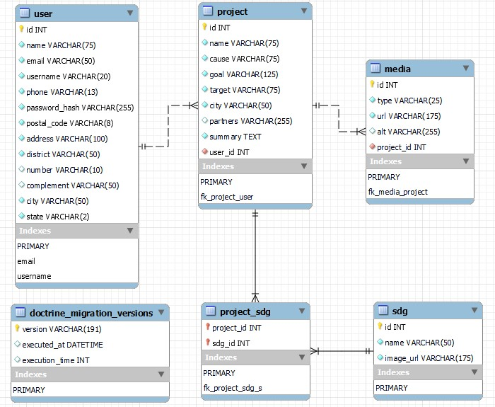

# Projeto Integrador - Documentação

## Índice

- [Produto](#produto)
- [Objetivo (meta)](#objetivo-meta)
- [Rodando o projeto](#rodando-o-projeto)
	- [Instalações necessárias](#instalações-necessárias)
	- [Configurando o ambiente](#configurando-o-ambiente)
	- [Executando](#executando)
- [Requisitos](#requisitos)
	- [Funcionais](#funcionais)
	- [Não funcionais](#não-funcionais)
- [Tarefas](#tarefas)
- [Testes](#testes)
- [Linguagens, _frameworks_ e ferramentas](#linguagens-frameworks-e-ferramentas)
- [Diagramas](#diagramas)
- [_Design_ e _layouts_](#design-e-layouts)

## Produto

_Website_ para registro e mapeamento de projetos sociais no estado do Rio Grande do Sul, inspirados nos Objetivos de Desenvolvimento Sustentável da ONU e no projeto Dojotech.

## Objetivo (meta)

Desenvolver um projeto que englobe todos os tópicos do curso técnico em desenvolvimento de sistemas, incluindo desenvolvimento back-end, desenvolvimento web, responsividade e bancos de dados.

## Rodando o projeto

### Instalações necessárias

Para executar o projeto é preciso ter instalado o [**PHP**](https://www.php.net/); a versão utilizada para o desenvolvimento foi a **8.3.2**. É necessário, também, o uso do [**Composer**](https://getcomposer.org/) como gerenciador de dependências.

Também será necessário instalar o [**MySQL**](https://dev.mysql.com/downloads/windows/installer/8.0.html); a versão utilizada para o desenvolvimento foi a **8.0.31**.

É recomendado que o usuário utilize as versões mais próximas possíveis das utilizadas em desenvolvimento. Tenha em mente que versões anteriores podem causar problemas de compatibilidade e erros na execução do projeto.

Por fim, é recomendado que a _IDE_ utilizada para rodar o _front-end_ do projeto seja o [**VS Code**](https://code.visualstudio.com/).

### Configurando o ambiente

O _back-end_ do projeto encontra-se no repositório [**dojotech-api**](https://github.com/xlucaspx/dojotech-api).
O _front-end_ do projeto encontra-se no repositório [**dojotech_somar**](https://github.com/xlucaspx/dojotech_somar).

Após clonar ambos repositórios, siga as instruções abaixo para configurar o ambiente e rodar o projeto corretamente.

#### Variáveis de ambiente

Visando tornar o projeto mais seguro e sua configuração mais simples, são utilizadas **variáveis de ambiente** para guardar informações sensíveis. Para configurar as variáveis de ambiente com [**phpdotenv**](https://github.com/vlucas/phpdotenv), é preciso criar um arquivo chamado `.env` na pasta raiz do _back-end_ do projeto com as chaves e valores que se deseja guardar; no arquivo **exemplo.env**, as chaves já estão disponíveis, você pode apenas renomear o arquivo para `.env` e preencher com os devidos valores.

Seu arquivo `.env` deverá se parecer com:

```env
# Credenciais de acesso ao banco de dados:
DB_DRIVER="pdo_mysql"
DB_HOST="127.0.0.1"
DB_PORT="3306"
DB_USERNAME="seu_usuario"
DB_PASSWORD="sua_senha"
DB_DATABASE="nome_do_banco"

# Segredo Token JWT
TOKEN_SECRET="uma senha para validar seus tokens"
```

#### MySQL

Este projeto utiliza o [**Doctrine**](https://www.doctrine-project.org/index.html) como _ORM_ para realizar ações no banco de dados. Para que isso funcione corretamente, você precisa criar um banco de dados e, no arquivo `.env`, você deve substituir os valores de **DB_USERNAME** pelo nome do seu usuário que vai acessar o banco de dados no MySQL (lembrando que o usuário deve ter as permissões necessárias para realizar as operações), **DB_PASSWORD** pela senha deste usuário - ou uma _string_ vazia (`""`) caso não tenha senha - e **DB_DATABASE** pelo nome do banco de dados que você criou.

#### VS Code

Você vai precisar da extensão [**Live Server**](https://marketplace.visualstudio.com/items?itemName=ritwickdey.LiveServer) para rodar o _front-end_ do projeto. Isso é importante, pois caso você tente executar apenas os arquivos HTML do projeto, ocorrerão erros do [*CORS*](https://developer.mozilla.org/pt-BR/docs/Web/HTTP/CORS) e não será possível utilizar nenhuma funcionalidade.

Após instalar a extensão, deve aparecer um botão no canto inferior direito do VS Code com os dizeres "_Go Live_".

#### PHP

Navegue até a pasta raiz do _back-end_ do projeto pelo terminal. Execute comando `composer install` para instalar as [dependências](#dependências) do projeto. Quando a instalação for concluída, será necessário executar as _migrations_ para criar as tabelas do banco e popular alguns dados; para isso, é necessário executar o script `doctrine-migrations` dentro da pasta **vendor/bin** com o comando `migrations:migrate`:

```bash
.\vendor\bin\doctrine-migrations migrations:migrate
```

Agora você já deve ter todas as tabelas do projeto criadas no seu banco, com os dados necessários já inseridos.

#### Dependências

Pacotes do PHP necessários para executar o projeto; estão disponíveis também no arquivo **composer.json**:

- [PHP-DI](https://php-di.org/);
- [PHP dotenv](https://github.com/vlucas/phpdotenv);
- [PHP-JWT](https://github.com/firebase/php-jwt);
- [PSR HTTP-message](https://packagist.org/packages/psr/http-message);
- [PSR HTTP-server-handler](https://packagist.org/packages/psr/http-server-handler);
- [Symfony cache](https://symfony.com/doc/current/components/cache.html);
- [Doctrine ORM](https://github.com/doctrine/orm);
- [Doctrine DBAL](https://github.com/doctrine/dbal);
- [Doctrine annotations](https://github.com/doctrine/annotations);
- [Doctrine migrations](https://github.com/doctrine/migrations/);
- [Nyholm PSR7](https://github.com/Nyholm/psr7);
- [Nyholm PSR7-server](https://github.com/Nyholm/psr7-server).

### Executando

Para rodar o servidor no _back-end_ do projeto, ainda no terminal e na pasta raiz, execute o comando:

```
php -S localhost:3000 -t public/
```

A porta utilizada é a **3000** e apenas a pasta _public_ e seu conteúdo são visíveis para o navegador.

Para executar o _front-end_, abra o projeto no VS Code e navegue até a pasta **public/views**; abra o arquivo **index.html** e clique no botão "_Go Live_" do Live Server. Isto executará o projeto e permitirá que seja acessado no navegador; a porta utilizada por padrão é a **5500**.

Após seguir estes passos, o projeto deve estar funcionando corretamente em <http://127.0.0.1:5501/public/views>.

## Requisitos

### Funcionais

- [x] _CRUD_ projetos:
	- [x] Cadastro de projeto;
	- [x] Visualização de projeto;
	- [x] Edição de projeto;
	- [x] Exclusão de projeto.
- [x] _CRUD_ usuários:
	- [x] Cadastro de usuário;
	- [x] Visualização de usuário;
	- [x] Edição de usuário;
	- [x] Exclusão de usuário.
- [x] _Login_ e autenticação de usuário;
- [x] Deve ser possível realizar a filtragem de projetos:
	- [x] por ODS;
	- [x] por cidade;
	- [x] por causa de atuação;
	- [x] por público-alvo.
- [x] Deve ser possível adicionar até 5 imagens por projeto;
- [x] Deve ser possível adicionar um vídeo por projeto;
- [x] Deve ser possível visualizar a quantidade total de projetos;
- [x] Deve ser possível visualizar a quantidade de projetos por ODS;
- [x] Deve ser possível gerar um relatório de sustentabilidade contendo o total de projetos e o total de projetos por ODS.

### Não funcionais

- [x] O site deve ser acessível a todos os tipos de usuários (acessibilidade);
- [x] O site deve ser responsivo e funcionar em _desktop_ e dispositivos móveis;
- [x] Criar componentes que possam ser reutilizados, evitando repetição e facilitando a manutenibilidade do projeto;
- [x] Estruturar o projeto separando os arquivos por funcionalidade e coerência;
- [x] Procurar escrever o código de forma semântica e organizada, facilitando o entendimento do sistema;
- [x] Validar dados inseridos pelo usuário conforme regras de negócio;
- [x] Utilizar criptografia para guardar dados sensíveis, como a senha do usuário;
- [x] Utilizar token para realizar autenticação de usuário, evitando tráfego de dados sensíveis;
- [x] Utilizar expressões regulares para escapar possíveis entradas maliciosas do usuário;
- [ ] Deve ser possível adicionar textos descritivos para as imagens;
- [x] Validar e limitar tamanho máximo de _upload_ de mídias do projeto em 15 MB.

## Tarefas

- [x] Elaborar documentação técnica;
- [x] Decidir linguagens, _frameworks_ e ferramentas que serão utilizados;
- [x] Elaboração de protótipo do site;
- [x] Criação do banco de dados;
- [x] Desenvolver página inicial;
- [x] Desenvolver página de _login_;
- [x] Desenvolver página de cadastro de usuário;
- [x] Desenvolver página "Conheça nossos projetos";
- [x] Desenvolver página de cadastro de projeto;
- [x] Desenvolver página de projeto;
- [x] Realizar integração com banco de dados;
- [x] Desenvolver funcionalidades:
	- [x] _Login_ e autenticação;
	- [x] _Upload_ de imagens;
	- [x] _Upload_ de vídeo;
	- [x] Filtragem de projetos;
	- [x] Contabilização de projetos;
	- [x] Página de administração de dados do usuário;
	- [x] Botão "voltar" para facilitar navegação;
	- [x] Possibilidade de editar e excluir projeto.

## Testes

Devem ser realizados, na _API_ do projeto, testes de unidade nos modelos e _DTOs_ para verificar se as validações e regras de negócio estão sendo corretamente aplicadas. Também são necessários testes de integração com dados válidos e inválidos em cada uma das rotas, para verificar se o comportamento do sistema é o esperado, se a resposta devolvida é a correta e se a aplicação não quebra em nenhum dos cenários previstos.

No _front-end_ do sistema podem ser desenvolvidos testes que verifiquem se o _login_ e os formulários de cadastro/edição de usuário e cadastro/edição de projeto funcionam conforme o esperado; também é possível testar se a filtragem de projetos corresponde ao que foi previsto.	

## Linguagens, _frameworks_ e ferramentas

### _Front-end_

- HTML;
- CSS;
- JavaScript.

### _Back-end_

- PHP;
- MySQL.

### _Design_ e diagramação

- Figma;
- brModelo;
- Astah UML.

## Diagramas


Diagrama ER (Entidade-Relacionamento) do banco de dados

---



Modelo relacional do banco de dados

## _Design_ e _layouts_


Guia de Cores ODS

---


_Layout_ base da página inicial

---


_Layout_ base da página de _login_

---


_Layout_ base da página "Conheça nossos projetos"

---


_Layout_ base da página de projeto

---

